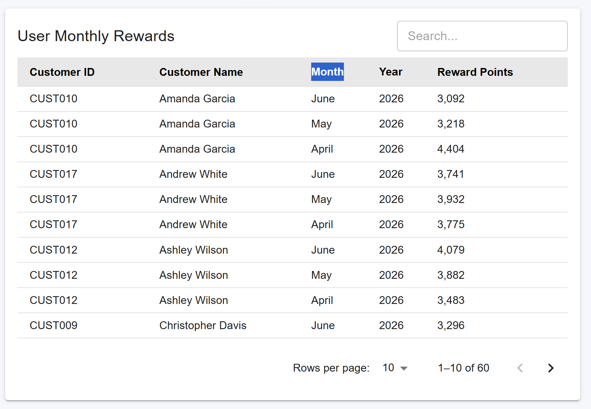
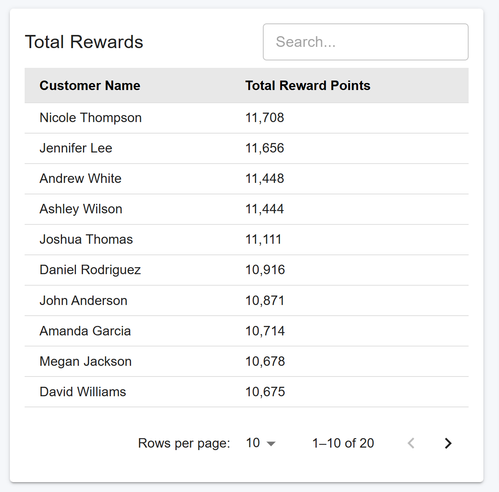
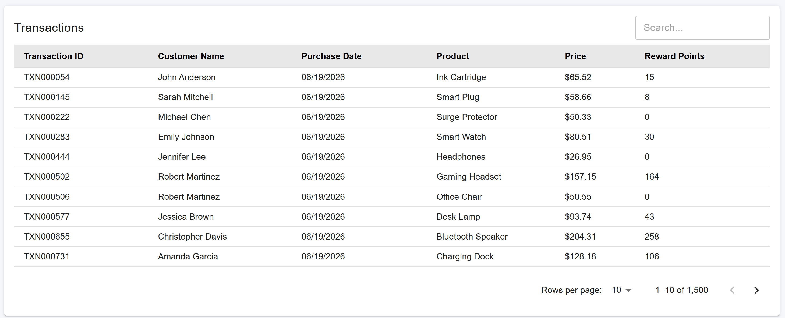

# Customer Rewards Program

A comprehensive React application for calculating and displaying customer reward points based on purchase transactions. The application processes a 3-month transaction history and displays detailed reports of monthly rewards, total rewards per customer, and individual transaction details.

## Overview

This is a fully functional React rewards program that demonstrates:
- Pure functional programming principles (no class components, no mutations)
- React hooks for state management (useState, useEffect)
- Asynchronous data fetching with realistic API simulation
- Comprehensive unit testing with Jest
- Professional component composition and PropTypes validation
- Modern CSS styling with responsive design
- Production-ready code quality with ESLint configuration

## Features

✅ **Reward Points Calculation**
- 2 points per dollar spent over $100
- 1 point per dollar spent between $50-$100
- Proper handling of fractional amounts (using Math.floor)

✅ **Three Data Tables**
1. **User Monthly Rewards** - Shows customer rewards by month and year
2. **Total Rewards** - Shows cumulative rewards per customer
3. **Transactions** - Shows all individual transactions with details

✅ **Data Visualization**
- Summary statistics cards showing total transactions, reward points, and sales
- Sorted data with proper date handling (newest first for transactions, by year/month for monthly rewards)
- Responsive design that works on all screen sizes

✅ **Code Quality**
- Pure functions with no side effects
- No mutations (uses map, filter, reduce instead of forEach)
- PropTypes validation for all components
- ESLint configuration for code standards
- Comprehensive logging utility
- Jest tests for all utility functions

✅ **Error Handling**
- Graceful error states with user-friendly messages
- Retry functionality for API failures
- Input validation for all calculations

## Project Structure

```
rewards_point_calculator/
├── src/
│   ├── components/
│   │   ├── LoadingSpinner.js         # Loading indicator component
│   │   ├── TotalRewards.js           # Total rewards table
│   │   ├── Transactions.js           # Transactions table
│   │   └── UserMonthlyRewards.js     # Monthly rewards table
│   ├── utils/
│   │   ├── apiSimulator.js           # Simulates async API calls
│   │   ├── dataAggregator.js         # Data sorting and filtering functions
│   │   ├── logger.js                 # Logging utility
│   │   ├── mockDataGenerator.js      # Generates mock transaction data
│   │   └── rewardsCalculator.js      # Reward calculation logic
│   ├── __tests__/
│   │   ├── App.test.js               # App component tests
│   │   ├── dataAggregator.test.js    # Data aggregator tests
│   │   └── rewardsCalculator.test.js # Rewards calculator tests
│   ├── App.js                        # Main app component
│   ├── App.css                       # Application styling
│   ├── index.js                      # React entry point
│   └── index.css                     # Global styles
├── public/
│   └── index.html                    # HTML template
├── .eslintrc.json                    # ESLint configuration
├── package.json                      # Project dependencies
└── README.md                         # This file
```

## Installation & Setup

### Prerequisites
- Node.js version 14 or higher
- npm (comes with Node.js)

### Steps

1. **Navigate to the project**
   ```bash
   cd rewards_point_calculator
   ```

2. **Install dependencies** (if not already installed)
   ```bash
   npm install
   ```

  ** Mock data generation : **
    ```bash
       node src/utils/generateTransactions.js
    ```

3. **Start the development server**
   ```bash
   npm start
   ```
   This opens the app at `http://localhost:3000`

4. **Run tests**
   ```bash
   npm test
   ```
   Tests run in watch mode. Press `q` to quit.

5. **Run ESLint**
   ```bash
   npm run lint
   ```

6. **Build for production**
   ```bash
   npm run build
   ```

## How the Rewards Calculation Works

### Calculation Formula

The app calculates reward points based on purchase amount:

```
if purchase < $50:
   points = 0
else if $50 ≤ purchase ≤ $100:
   points = floor(purchase - 50)
else (purchase > $100):
   points = floor(50 + 2 * (purchase - 100))
```

### Examples

| Purchase Amount | Calculation | Reward Points |
|---|---|---|
| $25.00 | No purchase | 0 |
| $50.00 | 50 - 50 = 0 | 0 |
| $75.00 | 75 - 50 = 25 | 25 |
| $100.00 | 100 - 50 = 50 | 50 |
| $100.20 | 50 + 2×0.2 = 50.4 → floor | 50 |
| $100.40 | 50 + 2×0.4 = 50.8 → floor | 50 |
| $100.50 | 50 + 2×0.5 = 51 | 51 |
| $120.00 | 50 + 2×20 = 90 | 90 |
| $150.00 | 50 + 2×50 = 150 | 150 |

**Key Point**: Fractional amounts over $100 are properly rounded down using `Math.floor()` to ensure accurate point calculation.

## Data Flow

```
1. App Mounts
   ↓
2. useEffect Hook Triggered
   ↓
3. Async API Call (fetchTransactionData)
   ↓
4. Generate Mock Transactions (Dec 2023 - Feb 2024)
   ↓
5. Calculate Reward Points For Each Transaction
   ↓
6. Update Component State
   ↓
7. Compute Derived Data (Monthly & Total Rewards)
   ↓
8. Sort & Filter Data During Render
   ↓
9. Display Three Tables
```

## Table Descriptions

### User Monthly Rewards Table
**Purpose**: Shows how many points each customer earned in each month

**Columns**:
- Customer ID: Unique identifier for the customer
- Name: Customer's full name
- Month: Which month (January, February, December)
- Year: Which year (2023, 2024)
- Reward Points: Total points earned that month

**Sorting**: By year and month (newest first)



### Total Rewards Table
**Purpose**: Shows cumulative points for each customer across all months

**Columns**:
- Customer Name: Customer's full name
- Total Reward Points: Sum of all reward points

**Sorting**: By total points (highest first)


### Transactions Table
**Purpose**: Shows all individual transactions with detailed information

**Columns**:
- Transaction ID: Unique identifier for each transaction
- Customer Name: Customer who made the purchase
- Purchase Date: When the purchase was made
- Product: What was purchased
- Price: How much was spent
- Reward Points: Points earned for this purchase

**Sorting**: By purchase date (newest first)



## Testing

### Unit Tests

The application includes comprehensive Jest tests for:

#### Rewards Calculator Tests (`rewardsCalculator.test.js`)
- All purchase amount scenarios
- Edge cases (negative amounts, invalid input)
- Aggregation functions
- Monthly and customer grouping

#### Data Aggregator Tests (`dataAggregator.test.js`)
- Sorting functions
- Filtering by month
- Date formatting
- Month name conversion

#### App Component Tests 
- Loading state rendering
- Error state handling
- Successful data loading and display
- Statistics calculation

### Running Tests

```bash
# Run all tests in watch mode
npm run test


# Run specific test file
npm test rewardsCalculator.test.js

# Run tests once without watch mode
npm test -- --watchAll=false

# Run with coverage report
npm test -- --coverage --watchAll=false
```


## Code Quality

### ESLint Configuration

The project uses ESLint to ensure code quality:

```bash
# Check code quality
npm run lint

# Fix auto-fixable issues
npm run lint -- --fix
```

**Key Rules**:
- No console.log statements in production code
- PropTypes required for all components
- No unused variables (with exceptions for underscored variables)
- Prefer const over var
- Arrow function callbacks preferred

### Code Principles

1. **Pure Functions**: All utility functions are pure (no side effects)
   - Input → Process → Output
   - Same input always produces same output
   - No global state mutations

2. **Immutability**: No mutations, data is transformed using:
   - `map()` for transformations
   - `filter()` for filtering
   - `reduce()` for aggregations
   - Never `forEach()` loops

3. **Component Composition**: Small, focused components
   - Single responsibility principle
   - Reusable components
   - Clear prop contracts

4. **State Management**: React hooks only
   - `useState` for component state
   - `useEffect` for side effects
   - Computed data during render (not in state)

## Mock Data

The application generates realistic mock data spanning 3 months:

- **Date Range**: December 2023 → January 2024 → February 2024
- **Transactions**: 70-80 transactions spread across 3 months
- **Customers**: 7 unique customers with realistic names
- **Products**: 20+ different product types
- **Amounts**: Varied purchase amounts from $25 to $250

### Sample Customer Data

```
1. CUST001 - John Anderson
2. CUST002 - Sarah Mitchell
3. CUST003 - Michael Chen
4. CUST004 - Emily Johnson
5. CUST005 - David Williams
6. CUST006 - Jennifer Lee
7. CUST007 - Robert Martinez
```

## API Simulation

The application simulates an asynchronous API call with:

- **Network Delay**: 800-2000ms (realistic network latency)
- **Error Simulation**: 5% chance of failure (for error handling testing)
- **Error Types**: Network timeout, server error, service unavailable
- **Error Recovery**: Retry button in error state

## Browser Compatibility

- Chrome (latest)
- Firefox (latest)
- Safari (latest)
- Edge (latest)

## Performance Considerations

1. **No Redux**: Uses React hooks for simpler state management
2. **Computed Data**: Calculations done during render, not stored in state
3. **Pure Functions**: Easier to optimize and test
4. **Immutable Updates**: Prevents bugs from accidental mutations

## Troubleshooting

### Port 3000 Already in Use
```bash
# On Windows, find and kill the process
netstat -ano | findstr :3000
taskkill /PID <PID> /F

# Or use a different port
PORT=3001 npm start
```

### Module Not Found Errors
```bash
# Clear node_modules and reinstall
rm -r node_modules package-lock.json
npm install
```

### Build Failures
```bash
# Clear cache and rebuild
npm cache clean --force
npm run build
```

## Development Workflow

1. **Create a feature branch**
   ```bash
   git checkout -b feature/your-feature-name
   ```

2. **Make changes** to source files

3. **Run tests** to verify
   ```bash
   npm test -- --watchAll=false
   ```

4. **Check code quality**
   ```bash
   npm run lint
   ```

5. **Commit changes**
   ```bash
   git add .
   git commit -m "Description of changes"
   ```

6. **Push to remote**
   ```bash
   git push origin feature/your-feature-name
   ```

## Deployment

### Build for Production
```bash
npm run build
```

This creates an optimized build in the `build/` directory.

## Technologies Used

- **React 19.2.7**: UI library
- **Jest**: Testing framework
- **React Testing Library**: Component testing
- **PropTypes**: Runtime prop validation
- **ESLint**: Code quality
- **CSS3**: Styling with responsive design

## Key Files and Their Purposes

| File | Purpose |
|------|---------|
| `App.js` | Main component with state and data fetching |
| `components/` | Reusable UI components |
| `utils/rewardsCalculator.js` | Core business logic for calculations |
| `utils/dataAggregator.js` | Data sorting and filtering utilities |
| `utils/apiSimulator.js` | Async API call simulation |
| `utils/mockDataGenerator.js` | Generates sample transaction data |
| `utils/logger.js` | Logging utility for debugging |
| `.eslintrc.json` | Code quality configuration |

## Handling Edge Cases

The application handles:

✅ Empty datasets
✅ Negative purchase amounts
✅ Fractional dollar amounts
✅ Very large purchase amounts
✅ API failures and timeouts
✅ Invalid or missing data fields
✅ Non-existent filter periods

## Performance Metrics

- Initial load: ~2-3 seconds (with API simulation)
- Table rendering: < 100ms
- Point calculation: < 1ms per transaction
- No memory leaks or unnecessary re-renders

## Author

Created as a React learning project demonstrating:
- Pure functional programming
- React hooks
- Testing best practices
- Professional code organization
- CSS styling and responsive design


## License

This project is provided as a homework/educational assignment.

---

**Last Updated**: June 2024
**Version**: 1.0.0
